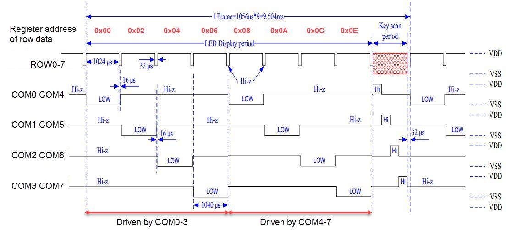
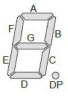

SAHA Display
============

The otherwise unused COM4-7 are connected to COM0-3 to allow higher duty cycle of 2/9 per refresh cycle compared to the standard 1/9.

Display data mapping
--------------------

Bits to segments in each register:

| 7  | 6 | 5 | 4 | 3 | 2 | 1 | 0 | 
|----|---|---|---|---|---|---|---|
| DP | G | F | E | D | C | B | A |

| Digit   | Addresses  |
|---------|------------|
| 0       | 0x00, 0x08 |
| 1       | 0x02, 0x0A |
| 2       | 0x04, 0x0C |
| 3       | 0x06, 0x0E |

Always write both bytes with same data. Rows 8..15 are not used.

Keys mapping
------------

3x5 keyboard, switches to bits in each register:

| 7 | 6 | 5 | 4  | 3  | 2  | 1  | 0  | 
|---|---|---|----|----|----|----|----|
| - | - | - | K4 | K3 | K2 | K1 | K0 |

| KS | Address |
|----|---------|
| 0  | 0x41    |
| 1  | 0x43    |
| 2  | 0x45    |

I2C Addressing
--------------

| Address | R1 | R2 | R3 |
|---------|----|----|----|
| 0x70    | -  | -  | -  |
| 0x71    | -  | -  | X  |
| 0x72    | -  | X  | -  |
| 0x73    | -  | X  | X  |
| 0x74    | X  | -  | -  |
| 0x75    | X  | -  | X  |
| 0x76    | X  | X  | -  |
| 0x77    | X  | X  | X  |
